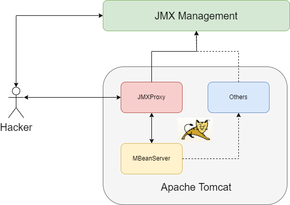
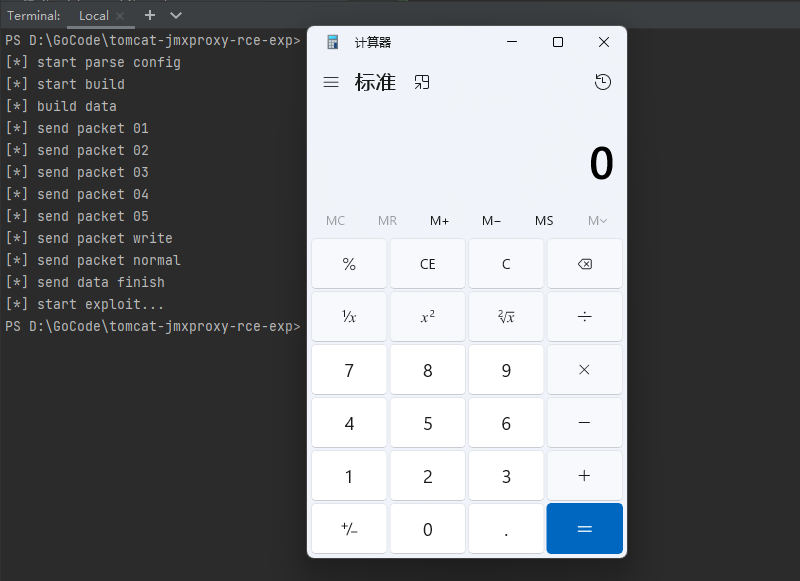

# tomcat-jmxproxy-rce-exp

**The tool is only used for security research. It is prohibited to use the tool to launch illegal attacks, and the user is responsible for the consequences**

**工具仅用于安全研究以及内部自查，禁止使用工具发起非法攻击，造成的后果使用者负责**

## About

Introduce: Apache Tomcat JMXProxy RCE

I reported this to **Apache Tomcat** as soon as I found the vulnerability, But **Apache Tomcat Security Team** does not consider this a security vulnerability, so it is open. 

The vulnerability is based on `JMXProxyServlet` in `Tomcat` and similar to **Spring4Shell**.

The `JMXProxyServlet` in `Tomcat` provides JMX monitoring related functions. However, basic authentication is required to access it, so it is difficult to exploit it in general.

Vulnerability are difficult to exploit directly and require high preconditions, but the third-party JMX management platform can bypass basic authentication, then RCE easily.

Affected:
- Apache Tomcat All Versions
- with JDK All Versions
- SpringBoot FarJar is not affected



Exploit Condition 1
- target must open jmxproxy manager
- hacker can access jmxproxy


Exploit Condition 2
- target must have JMX management platform (`MX4J` or others)
- hacker can access the platform

Exploit Condition 3
- target must open jmxproxy
- based on csrf vulnerability

## Exploit-1

edit: `conf/tomcat-user.xml`
```xml
<user username="admin" password="123456" roles="manager-jmx"/>
```

modify `config.ini` file

```text
# target ip
host=127.0.0.1
# target port
port=8080
# target tomcat jmxproxy username
username=admin
# target tomcat jmxproxy password
password=123456
# execute command
cmd=calc.exe
```

exploit: `./tomcat-jmxproxy-rce-exp`



## Exploit-2

If the JMX Management Platform (`MX4J` and others) can be accessed without authorization, directly modify `AccessLogValve` MBean attributes to perform RCE attack

## Exploit-3

CSRF+RCE / XSS+CSRF+RCE

In Apache Tomcat Document: 

"The HTML interface is protected against CSRF (Cross-Site Request Forgery) attacks, but the text and JMX interfaces cannot be protected."

So we can exploit with CSRF / XSS+CSRF